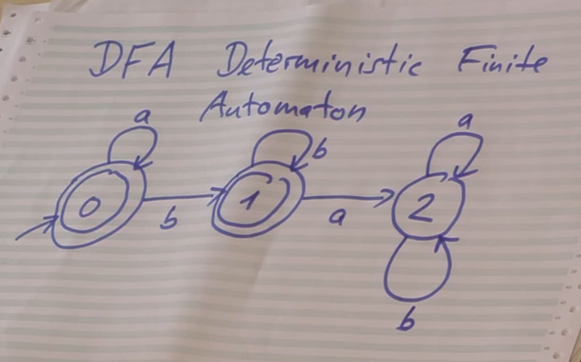

# automata

automata & python - computerphile

https://youtu.be/32bC33nJR3A

## logic

Sigma = {a, b}

Language = { words where as come before bs }

DFA (Deterministic Finite Automaton)

|  |
|:--:|
| <b>dfa image - captured from https://youtu.be/32bC33nJR3A</b>|

0 and 1 -> good state

2 -> bad state

## testcases

| Case            | Result |
| --------------- | ------ |
| aa              | OK     |
| aabbb           | OK     |
| ba              | KO     |
| aba             | KO     |
| ebsilon (empty) | OK     |

